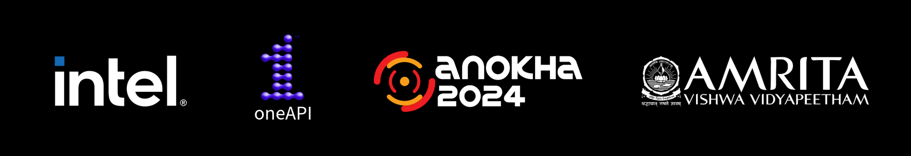
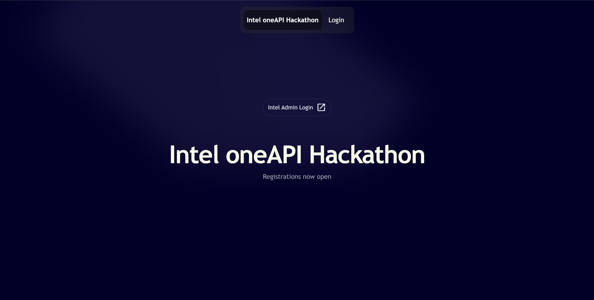
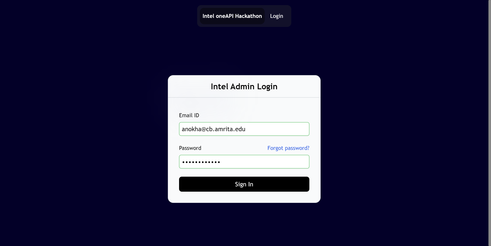
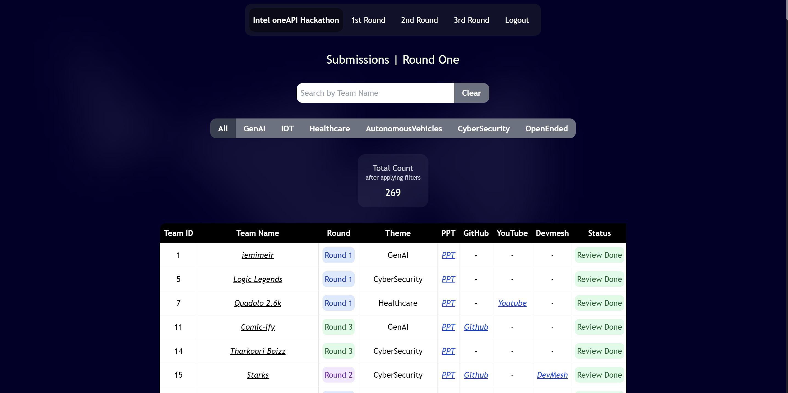
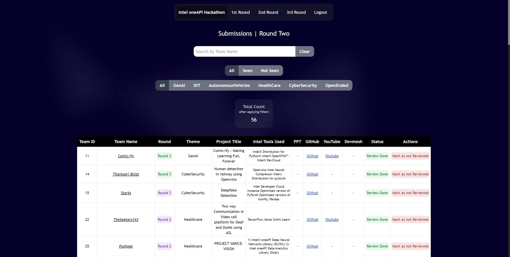
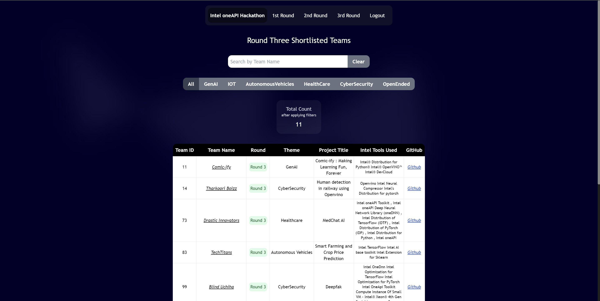
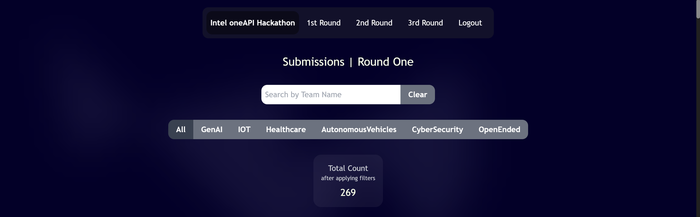
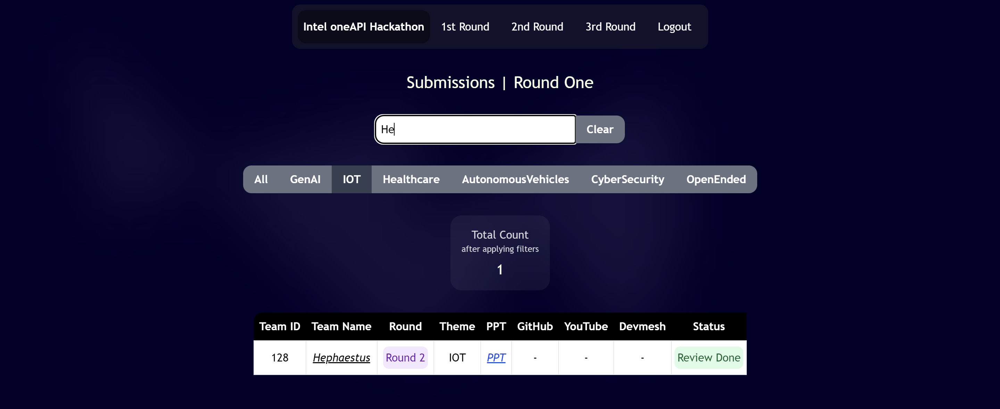
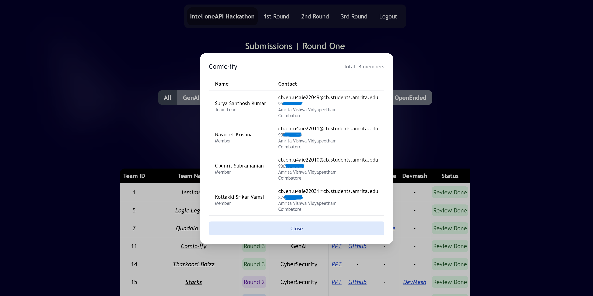
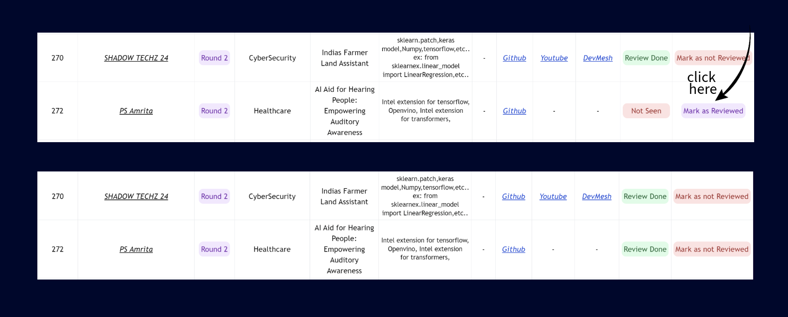

    
      

<h1 align='center'> Intel Hackathon Admin Dashboard </h1>

The Intel AI Hackathon conducted at Amrita Vishwa Vidyapeetham, Coimbatore, offered developers a platform to showcase innovative solutions for societal advancement. Participants were encouraged to use heterogeneous computing with Intel's oneAPI as the core programming paradigm.

 

This hackathon lead the developers to learn and work on the industry standard Intel's optimized frameworks. 

This Repository contains the frontend codebase for the admin dashboard used for evaluating the hackathon submissions and managing the promotion of teams and participants throughout the hackathon rounds.

# Login
> [!IMPORTANT]
> Enter the userEmail and password provided by Anokha WMD to login.

# Rounds

## Round 1
- PPT is compulsory for Round 1, all other Links/documents are optional
- Use the filter toggles to filter the teams based on topics
- Refer below for instructions on using filters, viewing team information and toggling review status.

## Round 2
- Github Link is compulsory for Round 2, other Links are optional

## Round 3
- Round 3 happens offline, judges will evaluate in person. No access to mark submission review status.

> [!NOTE]
> Qualifying teams to subsequent rounds happens Internally using Anokha's API and is not part of this Frontend.

# Using the Filters and Search Section

## The Interface
The Search bar allows us to search teams by team name.

## Output

# Viewing Team Information 
Click on a team Name to View team information and Member details.

# Toggling review status for submissions
Use the `Mark as Reviewed` / `Mark as not Reviewed` Buttons to mark review status.

# Security Policy
Refer [SECURITY.md](https://github.com/Abhinav-ark/intel_admin_anokha/blob/main/SECURITY.md) for Security Policy.

# Licensing
All code in this repository is Licensed Under [MIT License](https://github.com/Abhinav-ark/intel_admin_anokha/blob/main/LICENSE), and is freely available for anyone to use or make changes.

